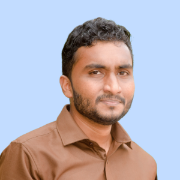
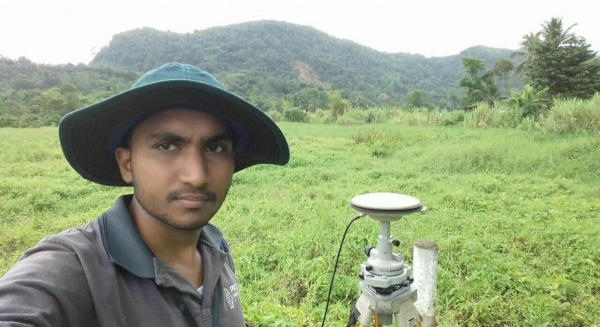
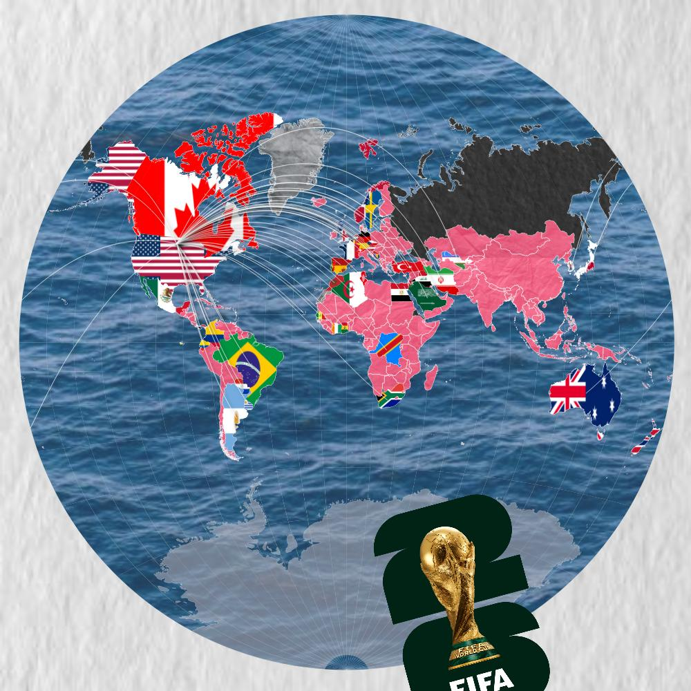
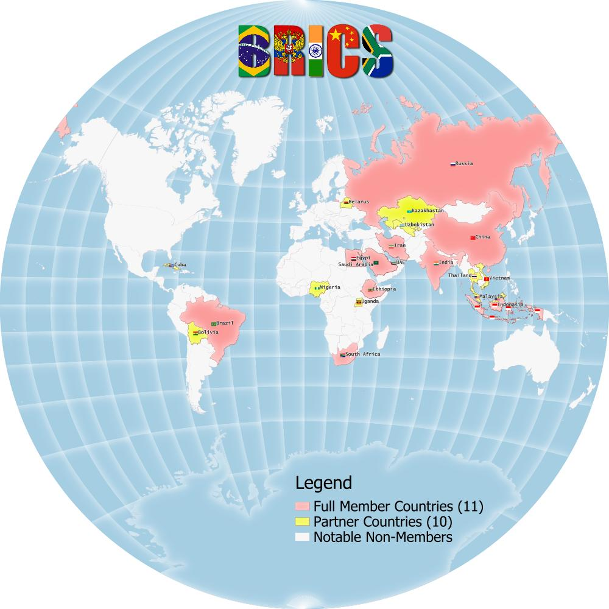

---
hide:
  - toc
  - navigation
---
<!--
CHECKLIST FOR THIS PAGE:
- [ ] Replace [YOUR NAME] with your full name (3 places)
- [ ] Replace [YOUR JOB TITLE] with your current or target role
- [ ] Replace [YOUR TAGLINE] with a short phrase describing your focus
- [ ] Rewrite the About Me paragraph with your own words
- [ ] Replace assets/images/profile.png with your actual photo (keep the filename or update it below)
- [ ] Replace assets/images/about.png with your own image (a field photo, map, or workspace shot)
- [ ] Edit the skill cards to match your actual skills (add, remove, or rename cards as needed)
- [ ] Update GitHub and LinkedIn links in the Connect section
- [ ] Add your CV PDF to docs/assets/ and update the filename in the Download CV button
-->

  
  <h1>Rifas Rafeek</h1>
  
<strong>Geospatial Data Analyst</strong>

  
<em>Turning spatial data into insights | GIS | Remote Sensing | Geo-Python | Civil Site Designing (C3D)</em>

---

## ***About Me***

Survey Engineer with 7 years of high-precision field experience transitioning into
full-time Geospatial Data Analyst. Proven track record in executing millimeter-level
engineering layouts for complex industrial infrastructure and international
airport projects. Professionally adept at bridging the gap between physical field
survey data and advanced digital spatial modeling. Offering specialized freelance
GIS analysis services, specializing in geoprocessing automation, remote sensing,
and interactive spatial data visualization to drive data-driven decision-making for
global clients.

  

---

[View My Projects :material-arrow-right:](projects/index.md){ .md-button .md-button--primary }
[Download CV :material-download:](assets/Rifas Ahamed-CV.pdf){ .md-button }

---

## ***Competencies***

-   :material-layers:{ .lg .middle } **GIS & Remote Sensing**

    ---

    - QGIS, ArcGIS Pro, Google Earth Engine
    - SAGA GIS, GRASS GIS
    - Multispectral and SAR image analysis
    

-   :material-code-braces:{ .lg .middle } **Programming**

    ---

    - Python — GeoPandas, NumPy, Pandas, Matplotlib
    - R — sf, terra, ggplot2
    - JavaScript — Leaflet, MapLibre GL
    - SQL, PostgreSQL + PostGIS
<!--
-   :material-star-four-points:{ .lg .middle } **Machine Learning & GeoAI**

    ---

    - Supervised classification — Random Forest, XGBoost
    - Deep learning for image segmentation — U-Net, SAM
    - scikit-learn, PyTorch, TensorFlow
    - Object detection in satellite imagery
-->

<!--
-   :material-earth:{ .lg .middle } **Web Mapping & Data**

    ---

    - Leaflet.js, Folium, MapLibre GL JS
    - Cloud storage — AWS S3, Google Cloud Storage
    - Data formats — GeoTIFF, GeoParquet, NetCDF
    - Streamlit for data-driven web apps

-   :material-database:{ .lg .middle } **Data & Cloud**

    ---

    - PostgreSQL + PostGIS
    - Cloud storage: AWS S3, Google Cloud Storage
    - Data formats: GeoJSON, GeoTIFF, NetCDF, Zarr, GeoParquet
-->

-   :material-airplane:{ .lg .middle } **Drone / UAV Data Processing**

    - Mission planning and flight operations
    - Photogrammetry: Agisoft Metashape, Pix4Dmapper, OpenDroneMap
<!--    - Point cloud processing: CloudCompare, PDAL -->

-   :material-compass-outline:{ .lg .middle } **Civil Site Designing (C3D)**

    ---

    - Site Design & Grading
    - Earthwork & Corridor Modeling
    - Survey Network Adjustments
    - Subdivision Layouts

---

## ***Featured Projects***

-   

    ---

    **FIFA World Cup 2026: Single-View Data Abstraction Map**

    Messy tournament data turned into one clear world map with flags, radial flow lines and a stadium inset.

    [:material-arrow-right: View project](projects/fifa_2026.md)

-   

    ---

    **BRICS 2026: Members and Partner Countries Infographic Map**

    A single-view infographic of the 11 full members and 10 partner countries, with flags, history and key metrics.

    [:material-arrow-right: View project](projects/brics.md)

[See all projects :material-arrow-right:](projects/index.md){ .md-button }

---

## ***Connect***

[GitHub](https://github.com/rifasrafeek){ .md-button }
[LinkedIn](https://linkedin.com/in/geovizrifas){ .md-button }
[ResearchGate](https://www.researchgate.net/profile/Rifas-Ahamed){ .md-button }
