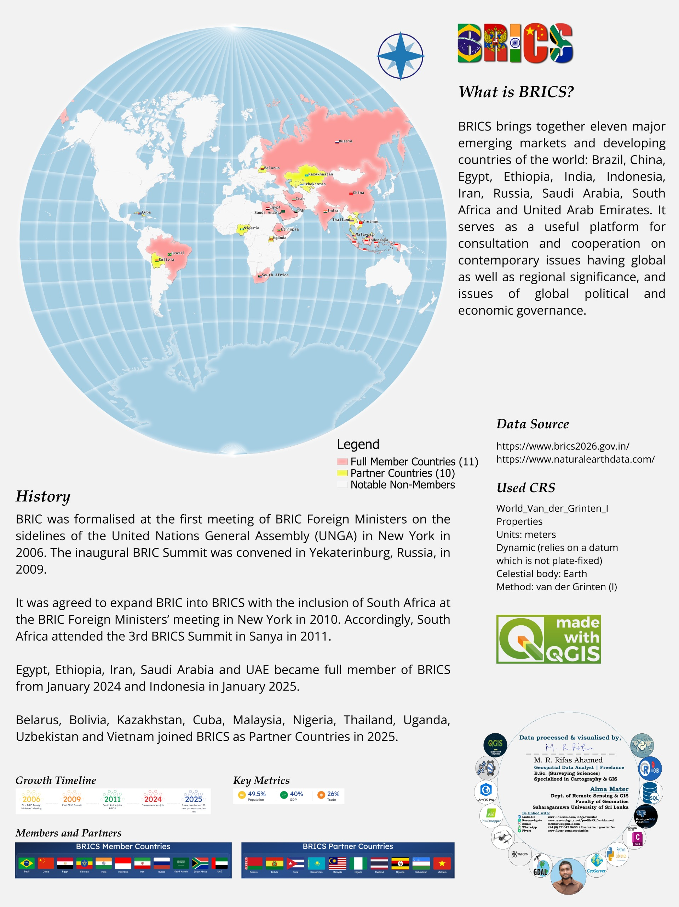

<!--
CHECKLIST FOR THIS PAGE (copy this file for each new project):
- [x] Replace [YOUR PROJECT TITLE] with your project title
- [x] Replace the hero image with your own (add to docs/assets/images/)
- [x] Update the Overview section
- [x] Update the Methods & Tools section
- [x] Update the Key Findings section
- [x] Update the Links section
- [ ] Add a card for this project on docs/projects/index.md
- [ ] Add a nav entry in mkdocs.yml
-->

# BRICS 2026: Members and Partner Countries Infographic Map

## Overview

A freelance cartography project for a school assignment, commissioned by a client in India who contacted me through LinkedIn. I designed a single-view infographic of the BRICS bloc following the 2026 summit in India. It shows the 11 full members and 10 partner countries with flags and labels, alongside the BRICS's history, growth timeline and key metrics.

**Study Area:** Global (BRICS full members and partner countries)  
**Duration:** 26 July 2026, 3 days from project confirmation  
**Role:** Solo project (freelance)  
**Status:** Completed, submitted and approved by the client

---

## Methods & Tools

**Data Sources**

- [BRICS 2026 India (official website)](https://www.brics2026.gov.in/): membership lists, history and key metrics
- [Natural Earth 1:10m Admin 0 – Countries](https://www.naturalearthdata.com/downloads/10m-cultural-vectors/10m-admin-0-countries/): country boundaries
- [Member states of BRICS (Wikipedia)](https://en.wikipedia.org/wiki/Member_states_of_BRICS), [BRICS (Wikipedia)](https://en.wikipedia.org/wiki/BRICS), [BRICS (Simple English Wikipedia)](https://simple.wikipedia.org/wiki/BRICS) and [18th BRICS summit (Wikipedia)](https://en.wikipedia.org/wiki/18th_BRICS_summit): supporting background and cross-checking

**Processing Steps**

1. Collected the current member and partner lists and the history details from the official BRICS 2026 website, and cross-checked them against Wikipedia.
2. Added the Natural Earth country boundaries and classified countries as full members, partner countries or notable non-members.
3. Set the projection to World Van der Grinten I so the whole world is visible in a single view.
4. Added flags and country labels to the member and partner countries.
5. Arranged the text, history, growth timeline, key metrics, flag panels, legend, data sources and credits in the QGIS Print Layout.

The project needed no complex geoprocessing, so the work focused on cartographic design and layout.

**Tools/ System Used**

| Tool/ System | Purpose |
|------|---------|
| QGIS | Data preparation, country classification, symbology and labelling |
| QGIS Print Layout | Final composition of the map, text, graphics and legend |
| World Van der Grinten I | Single-view world projection |
| Natural Earth | Country boundary data |

---

## Key Findings

- BRICS now has **11 full member countries** and **10 partner countries**, according to the latest summit held in India in 2026.
- The bloc accounts for **49.5% of the world's population**, **40% of global GDP** and **26% of global trade**.
- The bloc has grown in stages: BRIC was formalised in **2006**, South Africa joined in **2010–2011**, **Egypt, Ethiopia, Iran, Saudi Arabia and the UAE** became members in **January 2024**, **Indonesia** joined in **January 2025**, and **10 partner countries** were added in **2025**.
- The Van der Grinten I projection shows the bloc's global spread in a single view, from Brazil and South Africa to Russia, China and Southeast Asia.

---

## Links

[View BRICS 2026 Official Website](https://www.brics2026.gov.in/){ .md-button }
[View Natural Earth Data](https://www.naturalearthdata.com/downloads/10m-cultural-vectors/10m-admin-0-countries/){ .md-button }
[View BRICS on Wikipedia](https://en.wikipedia.org/wiki/BRICS){ .md-button }