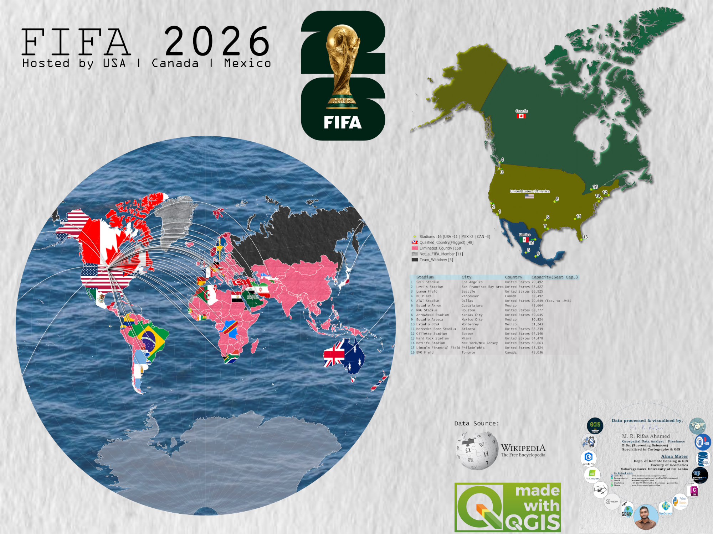

<!--
CHECKLIST FOR THIS PAGE (copy this file for each new project):
- [x] Replace [YOUR PROJECT TITLE] with your project title
- [x] Replace the hero image with your own (add to docs/assets/images/)
- [x] Update the Overview section
- [x] Update the Methods & Tools section
- [x] Update the Key Findings section
- [x] Update the Links section
- [ ] Add a card for this project on docs/projects/index.md
- [ ] Add a nav entry in mkdocs.yml
-->

# FIFA World Cup 2026: Single-View Data Abstraction Map

## Overview

A freelance cartography project for a client based in Finland, who contacted me through LinkedIn. I turned messy FIFA World Cup 2026 tabular data into one clear map layout. Qualified teams are shown with national flags and linked by radial flow lines to the host region, while an inset map locates all 16 stadiums across the USA, Canada and Mexico.

**Study Area:** Global (all FIFA member nations), with a North America inset for the three host countries  
**Duration:** 18 July 2026 – 22 July 2026 (3 days of work; assigned 18 July, submitted 21 July, approved by client 22 July)  
**Role:** Solo project (freelance)  
**Status:** Completed

---

## Methods & Tools

**Data Sources**

- [FIFA World Cup 2026 official tournament page](https://www.fifa.com/en/tournaments/mens/worldcup/canadamexicousa2026): official tournament information
- [2026 FIFA World Cup (Wikipedia)](https://en.wikipedia.org/wiki/2026_FIFA_World_Cup): qualified teams, stadium names, cities and seating capacities
- [Natural Earth 1:10m Admin 0 – Countries](https://www.naturalearthdata.com/downloads/10m-cultural-vectors/10m-admin-0-countries/): country boundaries
- [Natural Earth 1:10m Admin 2 – Counties](https://www.naturalearthdata.com/downloads/10m-cultural-vectors/10m-admin-2-counties/): county-level boundaries

**Processing Steps**

1. Scraped and cleaned the tabular data on qualified teams and stadiums.
2. Joined the cleaned tables to the Natural Earth country boundaries and classified every country (qualified, eliminated, not a FIFA member, withdrawn).
3. Geocoded the 16 stadiums and numbered them to match the stadium table.
4. Added raster flags as symbols for the 48 qualified countries.
5. Drew radial flow lines from each qualified country to the host region using the Shape Tools plugin (XY to Line).
6. Set the projection to World Van der Grinten I (ESRI:54029) so all countries fit in one view.
7. Compiled the final map, North America inset, legend and stadium table in the QGIS Print Layout.

**Tools Used**

| Tool | Purpose |
|------|---------|
| QGIS | Data processing, spatial joins, symbology and map design |
| QGIS Shape Tools plugin (XY to Line) | Radial flow lines from qualified countries to the host region |
| QGIS Print Layout | Final composition: main map, inset, legend, stadium table and credits |
| World Van der Grinten I (ESRI:54029) | Single-view world projection |
| Natural Earth | Country and county boundary data |
| Wikipedia / FIFA | Tournament and stadium attribute data |

---

## Key Findings

- **48** countries qualified, **158** were eliminated, **11** are not FIFA members and **5** teams withdrew, all classified in one view.
- **16 stadiums** host the tournament: **11 in the USA, 3 in Mexico and 2 in Canada**. Capacities range from about 43,000 (BMO Field, Toronto) to about 81,000 (Estadio Azteca, Mexico City).
- The goal was data abstraction. Messy tabular data became a clean, easy-to-read single-view map that anyone can understand at a glance.
- The Van der Grinten I projection keeps all countries visible in one frame, so the flow lines show where teams come from relative to the hosts.

---

## Links

[View FIFA Tournament Page](https://www.fifa.com/en/tournaments/mens/worldcup/canadamexicousa2026){ .md-button }
[View Wikipedia Data Source](https://en.wikipedia.org/wiki/2026_FIFA_World_Cup){ .md-button }
[View Natural Earth Data](https://www.naturalearthdata.com/downloads/10m-cultural-vectors/10m-admin-0-countries/){ .md-button }