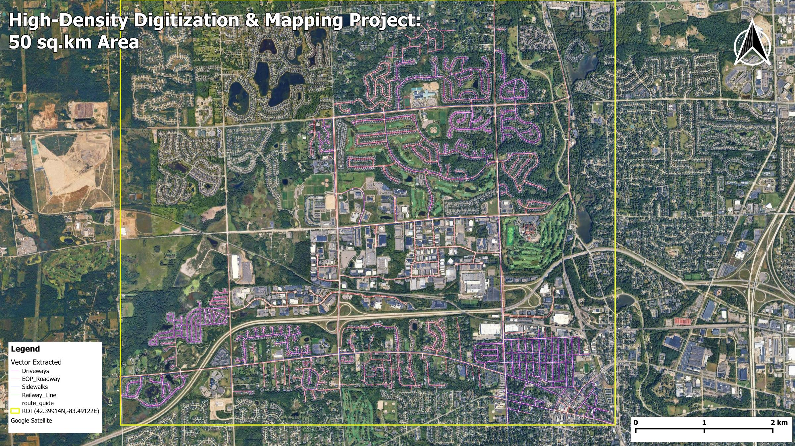
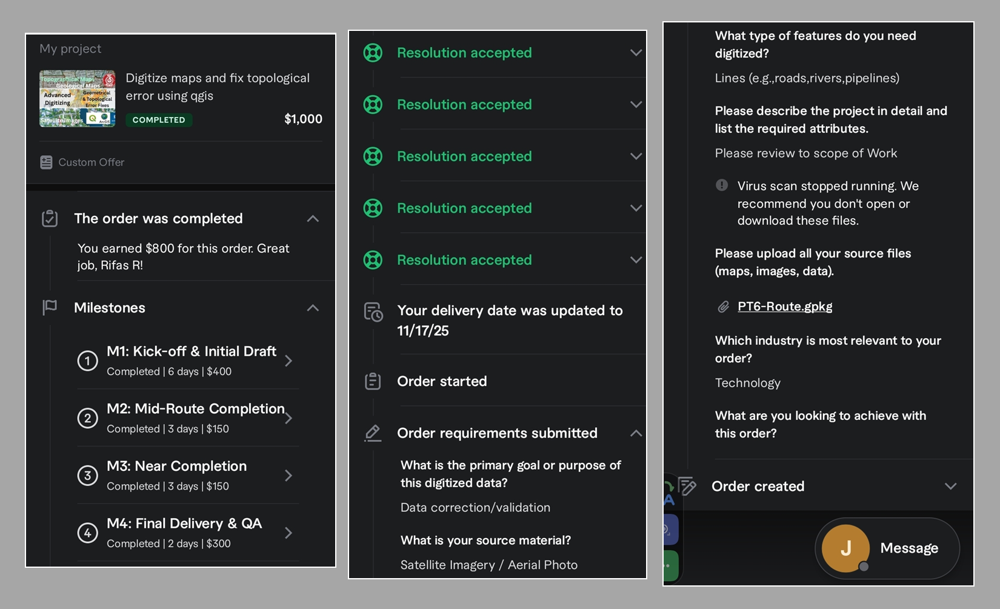

<!--
CHECKLIST FOR THIS PAGE (copy this file for each new project):
- [x] Replace [YOUR PROJECT TITLE] with your project title
- [x] Replace the hero image with your own (add to docs/assets/images/)
- [x] Update the Overview section
- [x] Update the Methods & Tools section
- [x] Update the Key Findings section
- [x] Update the Links section
- [ ] Add a card for this project on docs/projects/index.md
- [ ] Add a nav entry in mkdocs.yml
-->

# High-Density Digitization & Mapping: 50 sq.km Residential Area, Michigan

## Overview

A solo freelance project for a US client on Fiverr, valued at **USD 1,000**. I manually digitized roads, sidewalks, driveways and railway lines from satellite imagery across a 50 sq.km area, delivered as a single GeoPackage to support "Residential development site plans". I also published the results as an interactive web map.

**Study Area:** Northville / Plymouth area, Michigan, USA (centered on 42.39914°N, 83.49122°W)
**Project Value:** USD 1,000 (fixed-price custom offer, delivered in 4 milestones)  
**Duration:** November 2025 – January 2026 (agreed as a 14-day job, then extended five times with the client's approval after Cyclone Ditwah disrupted work in Sri Lanka)  
**Role:** Solo project (freelance)  
**Status:** Completed and approved by the client

---

## Interactive Web Map

  <iframe
    src="https://rifasrafeek.github.io/webmap-01/"
    title="High-Density Mapping and Digitization Project: 50 sq.km Area"
    style="position: absolute; top: 0; left: 0; width: 100%; height: 100%; border: 0;"
    loading="lazy"
    allow="geolocation"
    allowfullscreen>
  </iframe>

*Use the layer panel (top right) to switch layers and basemaps, or [open the full-screen web map](https://rifasrafeek.github.io/webmap-01/){ target=_blank }.*

---

## Methods & Tools

**Data Sources**

- Google Satellite and Google Hybrid basemaps in QGIS: primary imagery for digitizing (Hybrid was used to read road names)
- [Esri World Imagery Wayback](https://www.arcgis.com/home/group.html?sortField=title&sortOrder=asc&mode=keyword&id=0f3189e1d1414edfad860b697b7d8311#content): historical imagery used to see features hidden by tree canopy

**Processing Steps**

1. Set up the QGIS project with the ROI boundary and the satellite basemaps.
2. Split the job into four client milestones and worked in dated batches of vector layers.
3. Digitized four layers (EOP roadways, sidewalks, driveways and railway lines) by manual heads-up digitizing at a fixed scale, using snapping and topology rules.
4. Maintained an attribute schema (including road names) until the client confirmed the layers were for visualization only, then dropped it.
5. Reviewed Esri Wayback imagery for areas where tree canopy hid the features. I digitized those areas in ArcGIS Pro and appended them to the main GeoPackage in QGIS.
6. Ran QA/QC checks, then delivered all four layers in one GeoPackage in Web Mercator (EPSG:3857), as the client requested.
7. Published a web map with the qgis2web plugin (OpenLayers) on GitHub Pages, with search, geolocation, an expanded layer list and a metric measure tool.

**Tools/ System Used**

| Tool/ System | Purpose |
|------|---------|
| QGIS | Heads-up digitizing, snapping and topology checks, QA/QC |
| ArcGIS Pro | Digitizing canopy-covered areas against Esri Wayback imagery |
| Esri World Imagery Wayback | Historical imagery to see through tree canopy |
| GeoPackage (EPSG:3857) | Single-file delivery of all four layers |
| qgis2web (OpenLayers) | Exporting the interactive web map |
| GitHub Pages | Hosting the web map |

---

## Project Delivery & Client Feedback

The job was a fixed-price custom offer of **USD 1,000**, split into four milestones to keep progress and payment transparent for both sides.

| Milestone | Scope | Planned time | Value |
|-----------|-------|--------------|-------|
| M1 | Kick-off & Initial Draft | 6 days | $400 |
| M2 | Mid-Route Completion | 3 days | $150 |
| M3 | Near Completion | 3 days | $150 |
| M4 | Final Delivery & QA | 2 days | $300 |

[ When Cyclone Ditwah brought power cuts and disruption to Sri Lanka in late 2025, I told the client straight away and asked for more time. The client was friendly and supportive throughout and agreed to extend the deadline on humanitarian grounds. All four milestones were completed and the order was approved. ]

**Evidence: Fiverr order record**

*Screenshots from the Fiverr app showing the completed order, the four milestones and the accepted delivery-date resolutions.*

---
## Key Findings

- The project covered about **50 sq.km** (planimetric, in EPSG:3857). The ellipsoidal area is only about **28 sq.km**, because Web Mercator stretches areas at this latitude.
- Total digitized length: about **280 km** of EOP roadways, **237 km** of sidewalks, **110 km** of driveways and **0.2 km** of railway line.
- The client asked for roughly **1 ft (about 0.3 m)** positional accuracy.
- **Challenge:** Tree canopy hid roads and driveways in the Google imagery, and Google's historical imagery isn't available in QGIS. I tried other routes, including Google Earth Pro with Smart GIS, before finding that Esri Wayback imagery solved it.
- **Lesson learned:** The web map's geolocation and measure tools don't work reliably yet, and I'm still investigating the cause.
- **Delivery:** The timeline was extended five times for reasons outside my control. Splitting the work into four milestones kept the client informed and the project on track until approval.

---

## Links

[View Interactive Web Map](https://rifasrafeek.github.io/webmap-01/){ .md-button }
[View Web Map Code on GitHub](https://github.com/rifasrafeek/webmap-01){ .md-button }
[Esri Wayback Imagery](https://www.arcgis.com/home/group.html?sortField=title&sortOrder=asc&mode=keyword&id=0f3189e1d1414edfad860b697b7d8311#content){ .md-button }
[LinkedIn Post 1](https://lnkd.in/p/gMz8MHiG){ .md-button }
[LinkedIn Post 2](https://lnkd.in/p/gWTx_tSA){ .md-button }