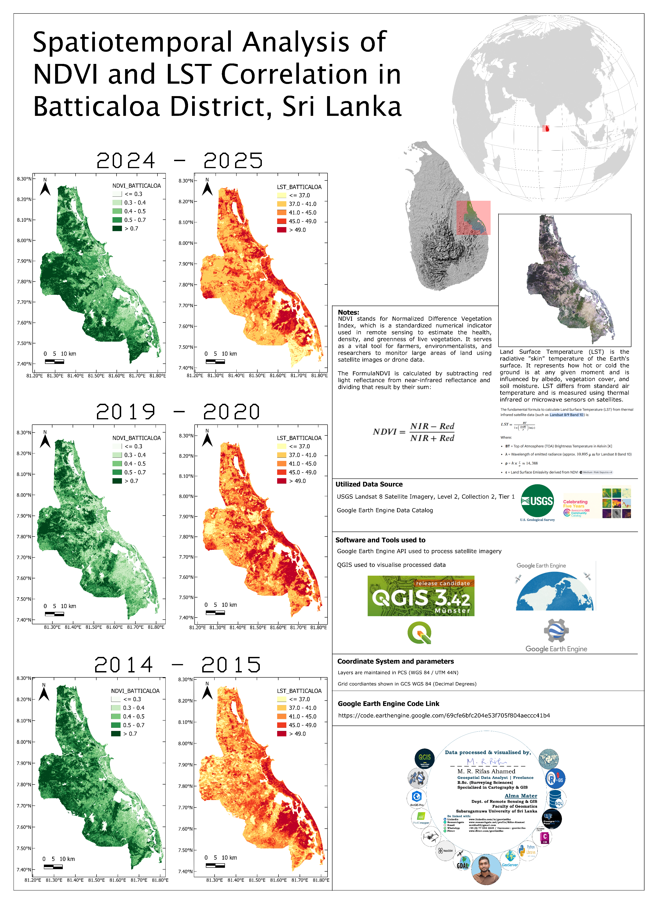
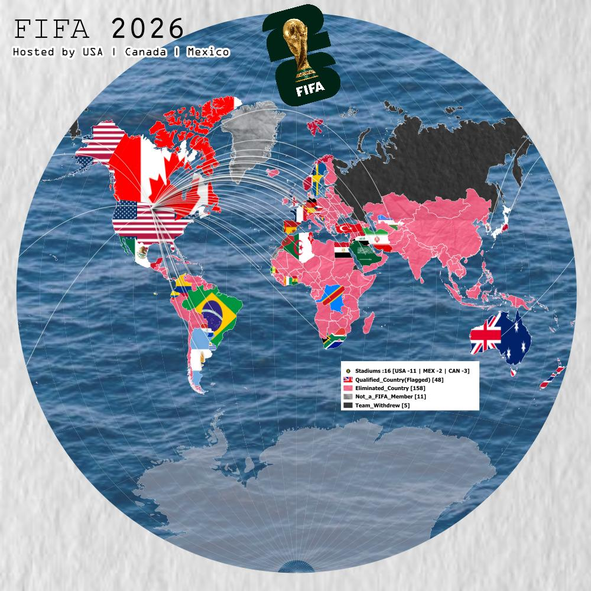
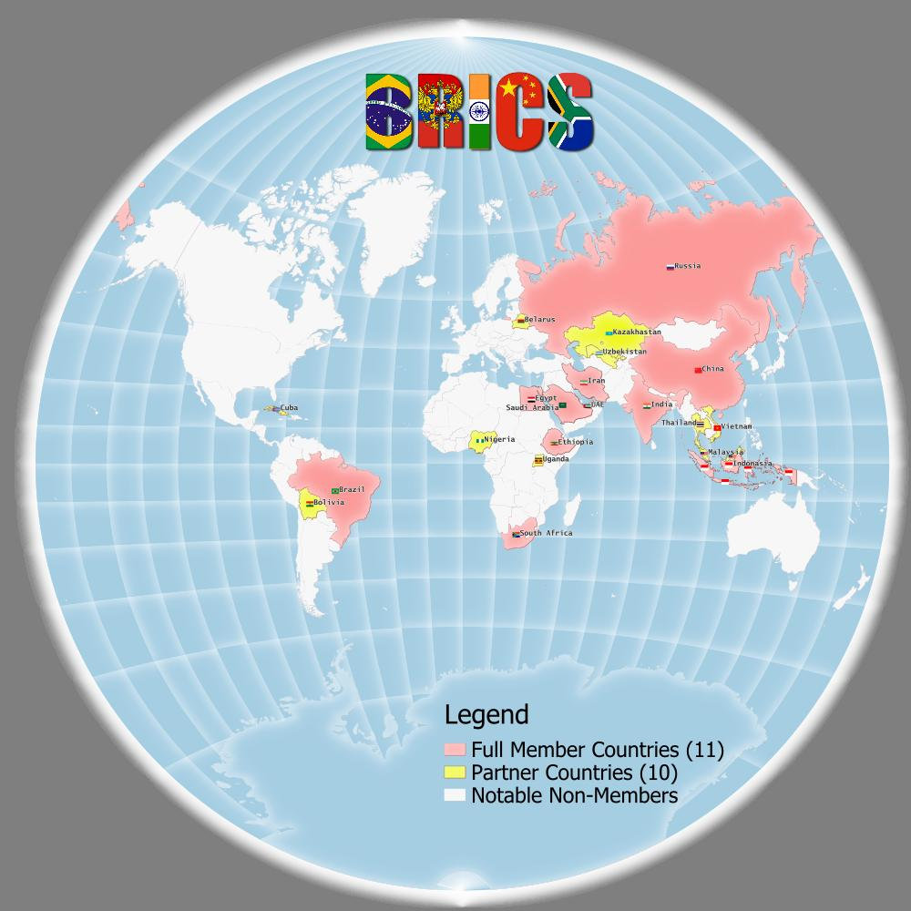

---
hide:
  - toc
  - navigation
---
<!--
CHECKLIST FOR THIS PAGE:
- [ ] Replace the two placeholder cards (marked [YOUR PROJECT ...]) with your real projects
- [ ] For each project: add a thumbnail image to docs/assets/images/ and update the path below
- [ ] For each project: create a project page by copying sample-project.md
- [ ] For each project: add a nav entry in mkdocs.yml (see the comments there)
- [ ] Delete placeholder cards you don't need yet
-->

# Projects

A selection of my geospatial projects. Click any card to see the full write-up.

**[Spatiotemporal Analysis of NDVI and LST Correlation in Batticaloa District, Sri Lanka](ndvi-lst-gee.md)**

Landsat 8 imagery was processed in Google Earth Engine, and the results were mapped in QGIS to show how surface temperature relates to vegetation cover.

`GEE-API` `QGIS` `GIMP`

[View Project →](ndvi-lst-gee.md){ .md-button }

**[FIFA World Cup 2026: Single-View Data Abstraction Map](fifa.md)**

Turned messy FIFA World Cup 2026 tabular data into one clear map layout. Qualified teams are shown with national flags and linked by radial flow lines to the host region.

`QGIS` `MS-Excel` `GIMP`

[View Project →](fifa.md){ .md-button }

**[BRICS 2026: Members and Partner Countries Infographic Map](brics.md)**

This Infographic shows the 11 full members and 10 partner countries with flags and labels, alongside the BRICS's history, growth timeline and key metrics.

`QGIS` `MS-Excel` `GIMP`

[View Project →](brics.md){ .md-button }

**[High-Density Digitization & Mapping: 50 sq.km Residential Area, Michigan](fiverr-0001.md)**

Manually digitized roads, sidewalks, driveways and railway lines from satellite imagery across a 50 sq.km area, delivered as a single GeoPackage to support **Residential development site plans**.

`QGIS` `[ArcGIS Pro]` `[Google Earth Pro]` `GIMP`

[View Project →](fiverr-0001.md){ .md-button }

<!--  a

**[Sample Notebook](sample-notebook.ipynb)**

[Add Your Text Here!]

`tool 1` `tool 2` `tool 3`

[View Project →](sample-notebook.ipynb){ .md-button }

a -->
